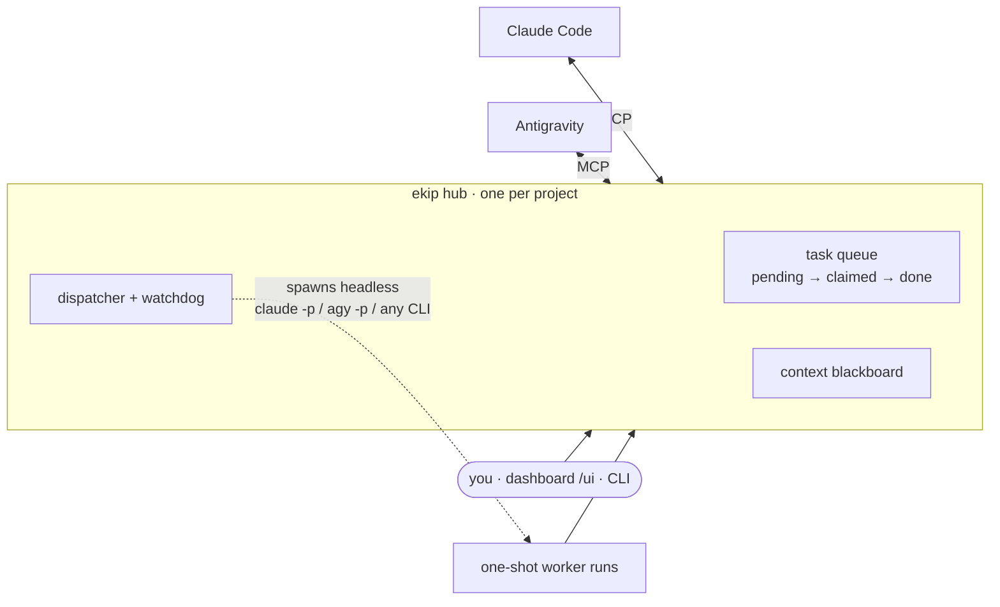
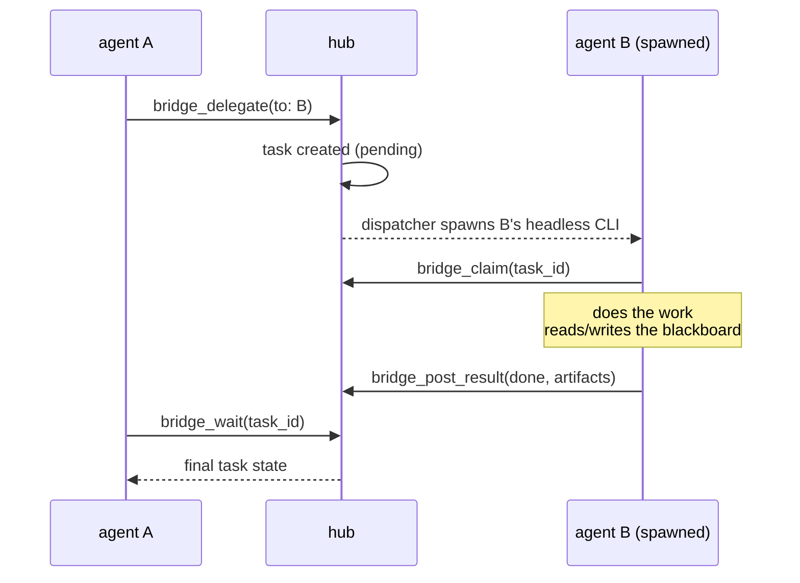

<div align="center">

# 🌉 ekip

**Make your coding agents work as a team.**

A vendor-neutral coordination hub that lets Claude Code, Google Antigravity,
and any headless CLI agent **delegate tasks to each other and share context**
— droppable into any project.

[](https://www.npmjs.com/package/@swtiit/ekip)


`plan → debate → code → review → audit` — an Opus architect, a Sonnet
reviewer, and a Gemini coder shipped a feature together in **5m39s**,
unattended, using this hub.

🇻🇳 [Hướng dẫn tiếng Việt](docs/HUONG-DAN.md)

</div>

---

## Why

Coding agents are getting great — but they work **alone**. The tools that do
connect them are one-way ("use agent B as a tool inside agent A") or heavy
(tmux supervisors, Python stacks). ekip takes a different shape:

- **Symmetric peers.** No agent is the boss. Everything flows through one
  hub, so either side can delegate to the other — including you, from the
  dashboard or CLI.
- **A shared blackboard.** Headless runs are one-shot; context survives on a
  key/value blackboard all agents read and write (`plan.v1`,
  `review.round1`, …).
- **Only sanctioned surfaces.** MCP servers + each vendor's official
  headless CLI (`claude -p`, `agy -p`). No scraping, no automation around
  rate limits.
- **npm-light.** One package, three dependencies, a single-file dashboard,
  no build steps at runtime.



## Quickstart

```bash
npm install -g @swtiit/ekip      # the installed command is `ekip`

cd /any/project
ekip init      # writes config + prints the MCP snippets to paste
ekip serve     # hub + dashboard, one terminal tab
```

`init` prints exactly what to paste into each agent (Claude Code's
`.mcp.json`, Antigravity's global config — including the permission grants
headless runs need). Then, from any connected agent or your own terminal:

```bash
ekip run coder "Add input validation to src/api/users.ts"
```

```text
task 54d00e94 → coder · dashboard: http://127.0.0.1:4319/ui

21:39:00  ● working  conductor  Feature pipeline: slugify
21:39:57    ✔ done  planner  Plan slugify implementation (51s)
             └ Plan stored at slug1.plan.v1: NFD-decompose + Mn-strip…
21:41:29    ✔ done  critic  SCORE:93
21:42:06    ✔ done  agy  Implement slugify.py + tests (30s)
             └ Self-verified: ALL TESTS PASSED
21:44:30  ✔ done  conductor  Feature pipeline: slugify (5m39s)

━━ DONE ━━ · auditor verdict: SHIP
```

## How a delegation works



Eight MCP tools cover the whole protocol: `bridge_delegate`, `bridge_claim`,
`bridge_post_result`, `bridge_wait`, `bridge_task_get`, `bridge_list_tasks`,
`bridge_context_set`, `bridge_context_get`. Full contract in
[PROTOCOL.md](PROTOCOL.md).

## Three ways to watch and drive it

| Surface | What you get |
| --- | --- |
| **Dashboard** `http://127.0.0.1:4319/ui` | Live task board (SSE), blackboard viewer/editor, per-task logs, artifact viewer, and a form to delegate work yourself — the human is one more peer |
| **CLI** | `run` (delegate + live-follow the whole task tree), `follow`, `tasks`, `task`, `logs`, `context`, `watch`, `ui` |
| **HTTP API** | `GET /api/state`, `GET /api/events` (SSE), `POST /api/delegate`, `POST /api/context`, `GET /api/logs/:taskId` |

## Multi-agent pipelines

The examples ship a field-tested crew and flow:

- **[examples/roles/](examples/roles/)** — standing "role skills" (conductor,
  planner, critic, coder, reviewer, auditor). Point an agent's `promptFile`
  at one and every spawn carries its persona, checklists, and output
  contracts.
- **[examples/feature-pipeline.md](examples/feature-pipeline.md)** — the full
  flow: plan → debate (to `SCORE ≥ 90`, capped) → code → review loop
  (capped) → audit (`SHIP`/`HOLD`) → human-readable report. Hub-and-spoke,
  so delegation depth stays ≤ 2 no matter how many stages.
- **[examples/mini-pipeline.md](examples/mini-pipeline.md)** — the 3-stage
  starter version, plus the hard-won "iron rules" for conductors.

## Configuration

`ekip.config.json`, one per project:

```json
{
  "project": "my-project",
  "host": "127.0.0.1",
  "port": 4319,
  "agents": [
    { "name": "planner", "adapter": "claude",
      "args": ["--model", "claude-opus-4-8", "--effort", "high"],
      "promptFile": ".ekip/roles/planner.md" },
    { "name": "coder", "adapter": "antigravity",
      "args": ["--model", "Gemini 3.5 Flash (High)"] },
    { "name": "codex", "adapter": "command",
      "command": "codex", "args": ["exec", "{prompt}"] },
    { "name": "me", "adapter": "claude", "spawnable": false }
  ],
  "maxDepth": 6,
  "watchdog": { "pendingTtlSeconds": 600, "claimedTtlSeconds": 3600 }
}
```

- **Machine defaults**: once a project's cast feels right, run
  `ekip init --global` there — it saves the agents and role files to
  `~/.ekip/`. Every future `ekip init` materializes that
  cast (and wires `.mcp.json`) automatically, so a new project is just
  `init && serve`. Project files always win over machine defaults, field by
  field; role `promptFile`s resolve in the project first, then
  `~/.ekip/roles/` by filename.
- **Model-per-role**: register the same adapter several times with different
  `--model` args — delegating to a *name* picks a *model*.
- `spawnable: false` registers an agent that polls (`bridge_claim`) instead
  of being auto-launched — e.g. a session you drive interactively.
- `promptFile` prepends a markdown role to every spawn of that agent.
- The **`command` adapter** plugs in any CLI with `{prompt}`, `{hubUrl}`,
  `{taskId}`, `{agent}`, `{depth}` templating — no code required.
- Project-level knowledge (conventions, lint, CI) belongs in each tool's
  native files — `CLAUDE.md` / `.claude/skills/` and `AGENTS.md` — which
  spawned runs pick up automatically.

## Letting spawned agents edit files

Out of the box a spawned run can only talk to the bridge. For real coding
(all field-tested):

- **Claude Code**: add `"--permission-mode", "acceptEdits"` to the agent's
  `args`; allowlist specific commands via `--allowedTools "Bash(npm test:*)"`.
- **Antigravity**: headless agy soft-denies anything needing a prompt, and a
  single denial kills the whole run. Grants live in
  `~/.gemini/config/config.json` under
  `userSettings.globalPermissionGrants.allow`: `"mcp(ekip/*)"` for
  the bridge tools, `"write_file(*)"` for a coder (scope tighter if you
  like), plus `"command(<cmd>)"` for each command it may run. The adapter
  always passes `--add-dir <cwd>` — without it, headless runs write into
  agy's scratch directory instead of your project.

## The watchdog (and the quota question)

Spawned agents die silently more often than you'd hope — quota exhaustion
(Claude's "session limit", agy's silent 429 exit), permission denials,
missing binaries. The hub sweeps orphaned tasks past their TTL to `failed`
and greps the spawn log for the *reason*, so the dashboard tells you
`watchdog: no claim within 600s — spawn log hints: "You've hit your session
limit…"` instead of hanging forever.

Neither vendor exposes remaining quota programmatically today, so the bridge
surfaces quota problems post-mortem — and the pipeline templates carry spawn
estimates (best case 6, worst case ~12 per feature run) so you can budget.

## Testing

```bash
npm test   # 45 end-to-end cases, no LLMs involved
```

Boots a real hub on a scratch port and exercises the HTTP API, all 8 MCP
tools, the dispatcher, permission/claim edge cases, watchdog reaping,
loop-guard, concurrency (parallel claims), crash-safety (missing binaries),
and the CLI as a subprocess.

## FAQ

**Does this violate any provider's terms?** It uses only documented
surfaces: MCP servers and official headless CLIs, each authenticated with
your own accounts. It never proxies one model through another, trains on
outputs, or works around rate limits.

**Do both apps have to be open?** No. Only the hub runs persistently. The
*receiving* agent is spawned headless on demand and exits when done; the
sender is whatever you're already working in (or the dashboard form).

**How do I add an agent that isn't Claude or Antigravity?** Usually zero
code: the `command` adapter + an args template. Bespoke behavior = one
adapter file implementing `spawn` + `mcpConfigSnippet`.

**What if two agents delegate to each other forever?** Every task carries a
delegation `depth`; the dispatcher refuses past `maxDepth` (default 6), and
pipeline templates cap their debate/review loops.

## Prior art & positioning

One-way bridges that expose agy as a *tool inside* Claude Code exist
([agy-bridge](https://github.com/sshahzaiib/agy-bridge),
[claude-to-agy](https://github.com/rauls-kjarners/claude-to-agy)), and
[AWS Labs CAO](https://github.com/awslabs/cli-agent-orchestrator)
orchestrates CLIs under a tmux supervisor–worker hierarchy. ekip
occupies the gap: **symmetric peer delegation + a shared blackboard**,
per-project, npm-light.

## License

[MIT](LICENSE)
