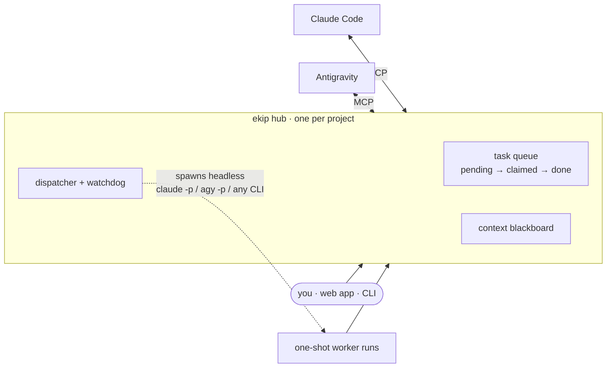
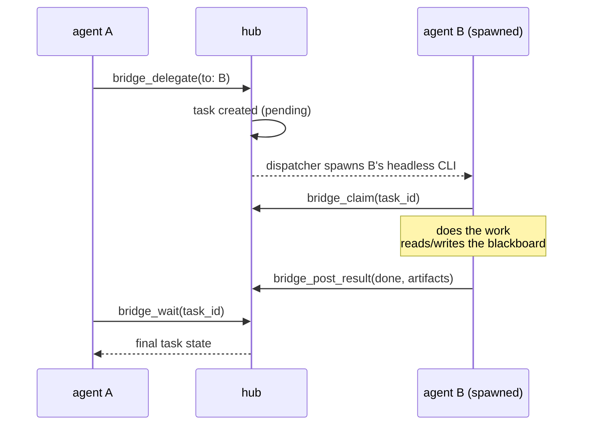

<div align="center">

# 🌉 ekip

**Make your coding agents work as a team.**

A vendor-neutral coordination hub that lets Claude Code, Google Antigravity,
and any headless CLI agent **delegate tasks to each other and share context**
— droppable into any project.

[](https://www.npmjs.com/package/@swtiit/ekip)


`plan → debate → code → review → audit` — an Opus architect, a Sonnet
reviewer, and a Gemini coder shipped a feature together in **5m39s**,
unattended, using this hub.

🇻🇳 [Hướng dẫn tiếng Việt](docs/HUONG-DAN.md)

</div>

---

## Why

Coding agents are getting great — but they work **alone**. The tools that do
connect them are one-way ("use agent B as a tool inside agent A") or heavy
(tmux supervisors, Python stacks). ekip takes a different shape:

- **Symmetric peers.** No agent is the boss. Everything flows through one
  hub, so either side can delegate to the other — including you, from the
  web app or CLI.
- **A shared blackboard.** Headless runs are one-shot; context survives on a
  key/value blackboard all agents read and write (`plan.v1`,
  `review.round1`, …).
- **Only sanctioned surfaces.** MCP servers + each vendor's official
  headless CLI (`claude -p`, `agy -p`). No scraping, no automation around
  rate limits.
- **Rules the hub enforces.** Flows run stage by stage inside the hub, with
  gates and capped loops — not instructions an agent may forget.
- **npm-light.** One package, three dependencies, a web app with no bundler,
  no build steps at runtime.


```mermaid
flowchart LR
    subgraph hub["ekip hub · one per project"]
        Q["task queue<br/>pending → claimed → done"]
        B["context blackboard"]
        D["dispatcher + watchdog"]
    end
    CC["Claude Code"] <-- MCP --> hub
    AG["Antigravity"] <-- MCP --> hub
    YOU(["you · web app · CLI"]) --> hub
    D -. "spawns headless<br/>claude -p / agy -p / any CLI" .-> W["one-shot worker runs"]
    W -- MCP --> hub
```

## Quickstart

```bash
npm install -g @swtiit/ekip      # the installed command is `ekip`

cd /any/project
ekip init      # writes config + prints the MCP snippets to paste
ekip serve     # hub + web app at http://127.0.0.1:4319/chat
```

`init` prints exactly what to paste into each agent (Claude Code's
`.mcp.json`, Antigravity's global config — including the permission grants
headless runs need). Then, from any connected agent or your own terminal:

```bash
ekip run claude-coder "Add input validation to src/api/users.ts"
ekip flow code-review "Add input validation to src/api/users.ts"   # coder → reviewer, gated
```

```text
task 54d00e94 → conductor · chat: http://127.0.0.1:4319/chat/54d00e94…

21:39:00  ● working  conductor  Feature pipeline: slugify
21:39:57    ✔ done  planner  Plan slugify implementation (51s)
             └ Plan stored at slug1.plan.v1: NFD-decompose + Mn-strip…
21:41:29    ✔ done  critic  SCORE:93
21:42:06    ✔ done  agy  Implement slugify.py + tests (30s)
             └ Self-verified: ALL TESTS PASSED
21:44:30  ✔ done  conductor  Feature pipeline: slugify (5m39s)

━━ DONE ━━ · auditor verdict: SHIP
```

## How a delegation works


```mermaid
sequenceDiagram
    participant A as agent A
    participant H as hub
    participant B as agent B (spawned)
    A->>H: bridge_delegate(to: B)
    H->>H: task created (pending)
    H-->>B: dispatcher spawns B's headless CLI
    B->>H: bridge_claim(task_id)
    Note over B: does the work<br/>reads/writes the blackboard
    B->>H: bridge_post_result(done, artifacts)
    A->>H: bridge_wait(task_id)
    H-->>A: final task state
```

Eleven MCP tools cover the whole protocol: `bridge_delegate`, `bridge_claim`,
`bridge_post_result`, `bridge_wait`, `bridge_cancel`, `bridge_say`,
`bridge_thread`, `bridge_task_get`, `bridge_list_tasks`, `bridge_context_set`,
`bridge_context_get`. Full contract in [PROTOCOL.md](PROTOCOL.md).

## Three ways to watch and drive it

The hub serves one web app at `http://127.0.0.1:4319`. It follows the hub's
reporting language, so a crew set to Vietnamese gets a Vietnamese interface.

| View | What you get |
| --- | --- |
| **Chat** `/chat` | Conversations on the left, grouped by the project folder each one works in (pick the folder before you send — recent folders or a built-in folder browser; agents then run inside it and read its `CLAUDE.md`/`AGENTS.md`), a transcript in the middle, the **crew** on the right. The transcript reads like a coding-agent session: your request as a bubble, each agent's words as prose, its tool calls as plain-language steps (open while it works, folded when done, the current step lit), work it **hands to another agent nested under the hand-off**, and a result card with receipts (files, logs) and what the run cost. Type `@` to pick who gets the message. The crew panel shows who is working on what, for how long, with Stop and Message on every member |
| **Board** `/board` | A kanban by state (queued, working, done, failed and stopped) with per-agent filters and search. Click a card for its request, result, model, tokens, cost, receipts and log. The blackboard sits alongside |
| **Guide** `/guide` | Diagrams of how the hub works, the life of a task, hand-offs, flows, and how to read cost — with your live crew |
| **Settings** `/settings` | Reporting language, and each member's name, job, model (live lists where the vendor offers one), effort, parallelism and auto-launch — all saved as you change them. Plus the hub's limits, the folder guard, billing, and the snippet to connect another agent |

An agent that is working lights its tally — the red lamp a camera shows while
it records — everywhere it appears. `⌘K` jumps to any view, conversation or
agent. Light and dark follow the system, with a toggle in the header.

And two more ways in:

| Surface | What you get |
| --- | --- |
| **CLI** | `run` (delegate + live-follow the whole task tree), `delegate`, `follow`, `cancel`, `flow`, `tasks`, `task`, `logs`, `context`, `config`, `agents`, `model`, `watch`, `status`, `ui` |
| **HTTP API** | `GET /api/state`, `GET /api/events` (SSE), `GET /api/threads`, `GET /api/thread/:taskId`, `POST /api/delegate` (with `parent_task_id` to reply into a thread, or `cwd` to pick the folder), `POST /api/cancel`, `POST /api/threads/delete`, `GET /api/flows`, `POST /api/flows/run`, `POST /api/context`, `GET /api/folders`, `GET /api/logs/:taskId` |

## Flows: pipelines the hub enforces

A conductor following a written pipeline can skip a gate or loop forever. A
**flow** moves those rules into the hub: it hands each stage to one role,
checks the result at a **gate**, sends the work back with the feedback when
the gate isn't met, and stops for good when the rounds run out.

```json
{
  "name": "code-review",
  "label": { "en": "Code, then review", "vi": "Code rồi review" },
  "steps": [
    { "id": "code", "agent": "claude-coder",
      "prompt": "{{input}}\n\nReview findings to fix (empty on the first round):\n{{feedback}}" },
    { "id": "review", "agent": "reviewer",
      "prompt": "Review the changes for: {{input}}\n\nReport: {{prev.code}}",
      "gate": { "startsWith": ["APPROVE"] },
      "onFail": { "goto": "code", "maxRounds": 2 } }
  ]
}
```

- Built in: **`code-review`** (above) and **`feature`** — plan → critique
  (`SCORE ≥ 90`, 3 rounds) → code → review (3 rounds) → audit (`SHIP`).
- Add your own as JSON in `.ekip/flows/` (project) or `~/.ekip/flows/`
  (machine). Prompts get `{{input}}`, `{{feedback}}`, `{{prev.<step>}}`,
  `{{round}}` and `{{run}}` (a per-run key for the blackboard). Gates match a
  score (`pattern` + `min`) or an opening word (`startsWith`).
- Run one from the Chat recipient picker, `⌘K`, `ekip flow <name> <input>`, or
  `POST /api/flows/run`. Every stage is a child task in one conversation, and
  each gate verdict (passed, back to a stage, stopped) is a line in it. A flow
  that names a role your crew lacks is listed with the reason and refused.

The role library behind it:

- **[examples/roles/](examples/roles/)** — standing "role skills" (conductor,
  planner, critic, coder, reviewer, auditor). Point an agent's `promptFile`
  at one and every spawn carries its persona, checklists, and output
  contracts. `coder.md` serves both the Claude and the Gemini coder — same
  craft, different model and permissions.
- **[examples/feature-pipeline.md](examples/feature-pipeline.md)** and
  **[examples/mini-pipeline.md](examples/mini-pipeline.md)** — the same
  pipelines written as conductor scripts, for crews that prefer an agent to
  drive.

### Who should get the work (measured)

One small task (a `slugify` helper with tests, graded on 8 hidden cases —
every route passed 8/8):

| Route | Wall time | Runs | Claude list price |
| --- | --- | --- | --- |
| Straight to `claude-coder` (Sonnet) | 49s | 1 | $0.27 |
| `gemini-coder` → `reviewer` (Sonnet) | 122s | 2 | $0.30 + Gemini quota |
| `conductor` (Sonnet, low effort) → `claude-coder` | 114s | 2 | $0.62 |

Small, clear work is cheapest sent straight to a coder. Having Claude review
Gemini's work does not save Claude quota — the review costs about as much as
doing it. A conductor adds a full run; it pays off on vague work that needs
splitting, while `code-review` is the cheaper way to make review mandatory.

## Configuration

`ekip.config.json`, one per project:

```json
{
  "project": "my-project",
  "host": "127.0.0.1",
  "port": 4319,
  "agents": [
    { "name": "planner", "adapter": "claude",
      "label": "Planner",
      "description": "Researches the repo and writes the plan. Does not write code.",
      "args": ["--model", "claude-opus-4-8", "--effort", "high"],
      "promptFile": ".ekip/roles/planner.md" },
    { "name": "gemini-coder", "adapter": "antigravity",
      "label": "Coder · Gemini",
      "description": "Writes and edits files. Cannot run shell commands.",
      "args": ["--model", "Gemini 3.6 Flash (High)"] },
    { "name": "codex", "adapter": "command",
      "command": "codex", "args": ["exec", "{prompt}"] },
    { "name": "me", "adapter": "claude", "spawnable": false }
  ],
  "maxDepth": 6,
  "maxConcurrent": 4,
  "watchdog": { "pendingTtlSeconds": 600, "claimedTtlSeconds": 3600 },
  "budget": { "runs": 20, "outputTokens": 0, "minutes": 120 },
  "retention": { "days": 14 }
}
```

- **Machine defaults**: once a project's cast feels right, run
  `ekip init --global` there — it saves the agents and role files to
  `~/.ekip/`. Every future `ekip init` materializes that
  cast (and wires `.mcp.json`) automatically, so a new project is just
  `init && serve`. Project files always win over machine defaults, field by
  field; role `promptFile`s resolve in the project first, then
  `~/.ekip/roles/` by filename.
- **`name` is the address, `label` and `description` are the meaning.** Agents
  hand each other work by `name`, so keep it short and stable. `label` is what
  people see in the app; `description` says what the member is for — it is
  shown in the app and told to every spawned agent as part of a crew roster,
  so a conductor picks the right member from what each one does rather than
  from its name. Both are editable in Settings, which also shows each role
  brief.
- **Model-per-role**: register the same adapter several times with different
  `--model` args — delegating to a *name* picks a *model*. The Settings view
  edits these live (applies to the next task, and writes the config file).
  Model lists come from `agy models` for Antigravity — read live, because the
  names move between releases — and for Claude, which has no list-models
  command, from the aliases, your account's cached options, and models the
  hub has seen running here.
- `spawnable: false` registers an agent that polls (`bridge_claim`) instead
  of being auto-launched — e.g. a session you drive interactively.
- **`maxConcurrent`** caps how many workers run at once **per folder**
  (default 4) and per agent within a folder (`"maxConcurrent": 1` on an agent
  entry); **`maxConcurrentTotal`** is the ceiling across all folders (default
  8). Delegations past a cap queue and launch FIFO as slots free — so a
  runaway conductor can't fork ten Opus runs into your quota, and a busy
  project doesn't stall another.
- **Folders.** Each conversation works in the folder it was started in, and
  each folder has its own blackboard. **`folderGuard`** (default `true`) tells
  every run its folder and, for Claude runs, adds a PreToolUse hook that
  checks file, search and shell calls — field-tested: without it, a headless
  `claude -p` read and wrote a sibling project freely. The hook reads paths
  out of commands, so it stops honest mistakes but not a determined bypass
  (`$HOME/…`, a symlink, a decoded script); treat it as a guard rail.
  Antigravity has no hook, so on macOS Gemini runs are started under the OS
  sandbox (`sandbox-exec`), which the kernel enforces: writes in your home go
  only to the folder and to agent state/caches (`~/.gemini`, `~/.cache`,
  `~/.npm`, `~/Library/Caches`…) — not shell startup files, LaunchAgents or
  other projects; reads of other home folders and of credentials (`~/.ssh`,
  `~/.aws`, `~/.netrc`, `~/.npmrc`, gh/docker/kube configs, Claude's files,
  shell history, browser profiles, Mail) are refused. The keychain file stays
  reachable because agy signs in through it. Field-tested with real agy runs.
  Set `"sandbox": true` on any agent (including Claude, for a hard boundary)
  to confine it the same way; `"sandbox": false` turns the Antigravity default
  off. Other platforms get the instruction only.
- **One editor per folder.** Members that edit files — `"writer": true`, or
  inferred: Antigravity, or Claude with `acceptEdits`/`bypassPermissions` —
  never run two at once in the same folder (`writersPerFolder`, default 1;
  `0` = no limit). The second one queues with "another agent is editing this
  folder", so two coders can't overwrite each other; read-only members run
  alongside.
- **`budget`** caps what one *request* may spend — a message you send (with
  everything agents hand out from it), a flow run, or a top-level delegation —
  in worker **runs**, **output tokens** and **minutes** (defaults: 20 runs, no
  token cap, 120 minutes; `0` turns a limit off). On a subscription these are
  what drain your plan. At a limit the hub refuses the next run with the reason
  in the conversation; running out of minutes also stops work in flight.
  Tokens are known only once a run reports, so a token cap stops the *next*
  run. A person's follow-up starts a fresh budget. A flow file may carry its
  own `budget`, and `POST /api/delegate` accepts one per request. Settings
  edits the hub default; the conversation header shows used/limit.
- **`retention.days`** drops finished tasks and their spawn logs after that
  many days (default 14; `0` keeps everything).
- **`language`** (e.g. `"Vietnamese"`) tells every spawned agent to write its
  notes, hand-offs and results in that language — code, paths and commands
  are untouched. Settings has a picker for it.
- `promptFile` prepends a markdown role to every spawn of that agent.
- The **`command` adapter** plugs in any CLI with `{prompt}`, `{hubUrl}`,
  `{taskId}`, `{agent}`, `{depth}` templating — no code required.
- Project-level knowledge (conventions, lint, CI) belongs in each tool's
  native files — `CLAUDE.md` / `.claude/skills/` and `AGENTS.md` — which
  spawned runs pick up automatically.

## Security

Anything that can reach the hub can launch agents that edit files, so:

- The hub listens on `127.0.0.1`. State-changing API and MCP requests must
  send `Content-Type: application/json` and, when a browser sends an Origin,
  come from the hub itself — a web page on another site can't drive it. The
  Host header must be one of the hub's own addresses (DNS rebinding).
- Set **`EKIP_TOKEN`** (or `"token"` in the config) to require a token on
  every API and MCP call: `Authorization: Bearer <token>` or `x-ekip-token`.
  The web app asks once and keeps it in an HttpOnly cookie; `ekip ui` opens
  it signed in; `ekip init` writes the header into `.mcp.json`; spawned
  workers get it automatically.
- A hub told to listen beyond loopback **refuses to start without a token**.
- **Each run proves who it is.** The hub gives every worker it launches a
  secret run key (in its instructions, its environment, and — for Claude — an
  MCP header). Only that key claims the task, so another session can't grab a
  task and post a fake "APPROVE" before the real reviewer does; queued tasks
  can't be claimed ahead of their run, and polling can't take work meant for a
  member the hub launches. A claimed task is reported only by its run while
  connected, and a reported result can't be replaced.
- **A run's hand-offs stay attached.** When a run calls `bridge_delegate`, the
  hub links the sub-task to that run's task — same folder, thread, budget and
  depth — and refuses a parent outside it.
- **Known limit:** without a hub token, any local process — including a run —
  can use the HTTP API directly (e.g. start a request in another folder). Set
  `EKIP_TOKEN` if the agents you run may be steered by untrusted content.

## Cost on a subscription vs an API key

Claude Code reports each run's tokens and `total_cost_usd`; ekip records both
(the dollar figure is list price × tokens, checked to the micro-dollar). What
that figure means depends on how `claude` is signed in:

- **Pro/Max subscription** (`claude auth status` says claude.ai): runs draw
  on your plan's limits and cost nothing per token. ekip detects this and
  hides dollar amounts — tokens and time stay — unless you switch them on in
  Settings.
- **`ANTHROPIC_API_KEY` in the hub's environment**: `claude -p` bills the API
  for real, and the app shows the money with a warning.

Token counts lead with output tokens; cache reads (0.1× price, often the
bulk) are shown separately so a run doesn't look ten times bigger than it
is. Antigravity reports no tokens, only time.

## Letting spawned agents edit files

Out of the box a spawned run can only talk to the bridge. For real coding
(all field-tested):

- **Claude Code**: add `"--permission-mode", "acceptEdits"` to the agent's
  `args`; allowlist specific commands via `--allowedTools "Bash(npm test:*)"`.
- **Antigravity**: model names move between releases (`agy models` lists what
  the installed binary accepts — a stale name exits 1 before the run starts,
  and ekip surfaces that line on the failed task). Headless agy soft-denies
  anything needing a prompt, and a
  single denial kills the whole run. Grants live in
  `~/.gemini/config/config.json` under
  `userSettings.globalPermissionGrants.allow`: `"mcp(ekip/*)"` for
  the bridge tools, `"write_file(*)"` for a coder (scope tighter if you
  like), plus `"command(<cmd>)"` for each command it may run. The adapter
  always passes `--add-dir <cwd>` — without it, headless runs write into
  agy's scratch directory instead of your project.

## When workers die (and the quota question)

Spawned agents die silently more often than you'd hope — quota exhaustion
(Claude's "session limit", agy's silent 429 exit), permission denials,
missing binaries. The hub keeps the worker's process handle: the moment it
exits without having posted a result, the task fails **within seconds**,
with the exit code and the *reason* grepped from the spawn log — so the
web app tells you `worker exited (code 0) without claiming the task —
spawn log hints: "You've hit your session limit…"` instead of hanging.

A watchdog remains as the safety net for workers that are alive but wedged
(TTL on `pending`/`claimed`, then the worker is killed), and `ekip cancel
<task>` (or `bridge_cancel` from any agent) stops a task and everything
delegated from it, killing the whole process tree.

Stopping the hub (Ctrl+C) stops the workers it started and marks their tasks
failed with the reason, so nothing keeps editing with nobody listening. On
the next start, work that was queued launches again, a flow that was
mid-run is failed with "the hub restarted" (its runner lived in the old
process), and the watchdog counts a run's streamed tool calls as signs of
life, so a long run that is still working isn't reaped. State is written
atomically; an unreadable state file is kept aside instead of overwritten.

Neither vendor exposes remaining quota programmatically today, so the bridge
surfaces quota problems post-mortem — and the pipeline templates carry spawn
estimates (best case 6, worst case ~12 per feature run) so you can budget.

## Testing

```bash
npm test   # 273 end-to-end cases, no LLMs involved
npm run test:ui   # 17 browser checks in headless Chrome (uses the installed Chrome)
npm run soak   # stability: bursts of work, cancels, a hub restart
```

Boots a real hub on a scratch port and exercises the HTTP API, all 11 MCP
tools, the conversation layer (stream-json decoding via a mock `claude`,
threads, `bridge_say`), the dispatcher, permission/claim edge cases, folders and the
folder guard, access control and tokens, flows (gate retry, round caps, cancel), budgets (runs, tokens, time), one editor per folder, result ownership, the OS sandbox (macOS), fail-fast on worker
exit, watchdog reaping (and worker kill), cancellation with process-tree
kill and cascade, `maxConcurrent` queueing, retention pruning, loop-guard,
concurrency (parallel claims), crash-safety (missing binaries), and the CLI
as a subprocess. The same suite runs in CI on Linux and macOS with Node 22 and 24, plus Node 26 on Linux.

`npm run soak` is the stability harness: rounds of mixed work (healthy, slow,
crashing, missing-binary and hanging workers) fired in bursts, cancels
mid-flight, and a hub restart — asserting that every task reaches a terminal
state, the concurrency cap holds, state and conversations survive the
restart, and no worker process is left behind. `SOAK_ROUNDS` and `SOAK_BURST`
turn up the pressure.

## FAQ

**Does this violate any provider's terms?** It uses only documented
surfaces: MCP servers and official headless CLIs, each authenticated with
your own accounts. It never proxies one model through another, trains on
outputs, or works around rate limits.

**Do both apps have to be open?** No. Only the hub runs persistently. The
*receiving* agent is spawned headless on demand and exits when done; the
sender is whatever you're already working in (or the web app).

**How do I add an agent that isn't Claude or Antigravity?** Usually zero
code: the `command` adapter + an args template. Bespoke behavior = one
adapter file implementing `spawn` + `mcpConfigSnippet`.

**What if two agents delegate to each other forever?** Every task carries a
delegation `depth`; the dispatcher refuses past `maxDepth` (default 6), and
flows cap every loop with `maxRounds`. `maxConcurrent` bounds the
blast radius in the meantime, and `ekip cancel` stops a whole tree.

## Prior art & positioning

One-way bridges that expose agy as a *tool inside* Claude Code exist
([agy-bridge](https://github.com/sshahzaiib/agy-bridge),
[claude-to-agy](https://github.com/rauls-kjarners/claude-to-agy)), and
[AWS Labs CAO](https://github.com/awslabs/cli-agent-orchestrator)
orchestrates CLIs under a tmux supervisor–worker hierarchy. ekip
occupies the gap: **symmetric peer delegation + a shared blackboard**,
per-project, npm-light.

## License

[MIT](LICENSE)
